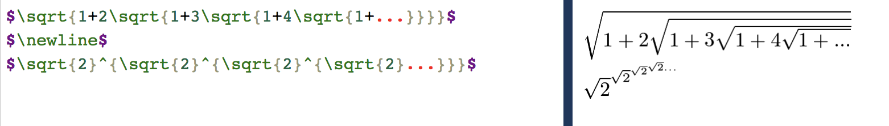

# Lab 3
### Part 0 Documentation
1. I want to make a game, I am pretty well versed in video games 
2. asdf
3. I want to work in python. I am not very familar with how to make GUI's but shouldn't be to hard figure out
4. I want to make a game that I have thought about for a while. The concept is a game where 2-D birds eye view game where the player has to collect alcholoic beverages. The more you collect the harder the controls get. I also want to distort the graphics and audio as well the more beverages you get in.

